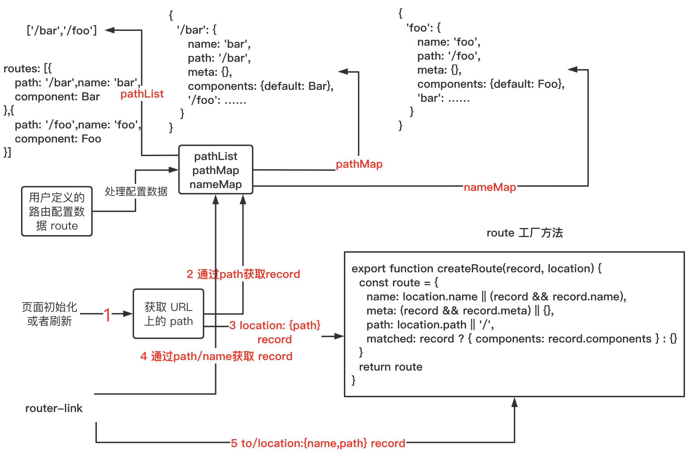
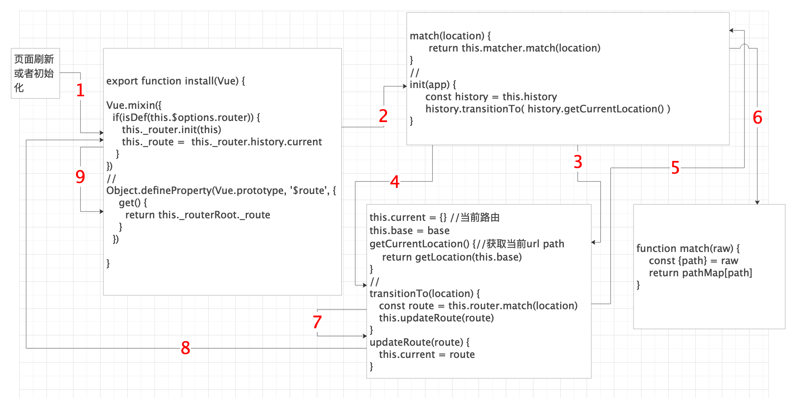

# 在项目中如何使用 `vue-router`

## 使用
```js{3,4,9,10}
import Vue from 'vue'
import App from './App.vue'
import VueRouter from '../router/index'
import route from './route'

Vue.config.productionTip = false

//
Vue.use(VueRouter)
const router = new VueRouter(route)

new Vue({
  router,
  render: h => h(App),
}).$mount('#app')
```
平时我们在项目开发中使用 `vue-router` 都会这样配置，那么他的内部代码是怎样的呢？跟这我的步伐，让我们一步一步现实一个简单的 `vue-router`

## VueRouter 文件
我们先上代码: `../router/index`
```js
import { install } from './install'
export default class VueRouter {
  constructor() {
  }
}
//
VueRouter.install = install // install方法
VueRouter.version = '__VERSION__' // 版本

// 如果是浏览器环境，并且有 window.Vue 则直接运行 Vue.use(VueRouter)
if (inBrowser && window.Vue) {
  window.Vue.use(VueRouter)
}
```
从代码可以看出 `vueRouter` 是一个 `class`, 并且在 `class` 上定义了一个 `install` 方法。当我们 `Vue.use(VueRouter)` 的时候，其实是执行了他的 `install` 方法
```js{1,4}
import VueRouter from '../router/index'
…………
//
Vue.use(VueRouter)
const router = new VueRouter(route)
new Vue({
  router,
  render: h => h(App),
}).$mount('#app')
```
那么 `install.js` 文件又做了什么呢？

## install.js 文件
```js{14,15}
import View from './components/view'
import Link from './components/link'

export let _Vue //这里暴露Vue,其他地方可以直接引用，无需再次 import vue from 'vue'

export function install(Vue) {
  //表示路由插件已经安装，无需再次安装，确保install方法只调用一次
  if (install.installed && _Vue === Vue) return
  install.installed = true

  _Vue = Vue

  //注册全局组件
  Vue.component('RouterView', View)
  Vue.component('RouterLink', Link)
}
```
代码很简洁，而且很容易看懂，最主要的功能就是注册了两个全局的组件: `RouterView` `RouterLink`

## $router 与 $route
`RouterView` `RouterLink` 之后会介绍，我们先搞清楚平时用的很多的  `$router` 与 `$route` 

`install.js` 文件添加一些代码
```js{8-17}
export function install(Vue) {
  //表示路由插件已经安装，无需再次安装，确保install方法只调用一次
  if (install.installed && _Vue === Vue) return
  install.installed = true

  _Vue = Vue
  //
  Object.defineProperty(Vue.prototype, '$router', {
    get() {
      return ？？？
    }
  })
  Object.defineProperty(Vue.prototype, '$route', {
    get() {
      return ？？？
    }
  })
  //注册全局组件
  Vue.component('RouterView', View)
  Vue.component('RouterLink', Link)
}
```
难怪我们在 `vue` 实例中都可以用 `this` 来获取这些变量，那么返回的值是什么呢？
### $router
明确的告诉你，`$router` 就是 `vueRouter` 创建的实例 `this`，而且还定义了一些实例方法
```js{4}
import { install } from './install'
export default class VueRouter {
  constructor() {
    // this
  }
  push() {}
  replace() {}
  go() {}
  back() {}
  forward() {}
  ……
}
```
那么怎么才能在每个 `vue` 的实例上获取到 `VueRouter` 实例呢？
```js{3}
 Object.defineProperty(Vue.prototype, '$router', {
    get() {
      return ？？？ //  new vueRouter(route)
    }
  })
```
我们平时写的代码
```js{1,3}
const router = new VueRouter(route)
new Vue({
  router,
  render: h => h(App),
}).$mount('#app')
```
我们创建的 `VueRouter` 实例对象放在了 `vue` 根实例的 `options` 里面
```js
app(根实例).options.router //VueRouter 实例对象
```
::: tip
如果每个 `vue` 实例上都挂载了根实例，就可以通过根实例获取到 `VueRouter` 实例对象
:::
install.js 增加了一些代码，请看代码里面的注释
```js{9-21,25}
export function install(Vue) {
  //表示路由插件已经安装，无需再次安装，确保install方法只调用一次
  if (install.installed && _Vue === Vue) return
  install.installed = true

  _Vue = Vue
  const isDef = v => v !== undefined
  // 为什么用混入，因为混入，每个vue实例都会执行这段代码，而this就是每个vue实例
  Vue.mixin({
    beforeCreate() {
      //这里的this就是每个页面的实例,我们需要为每个实例挂载_router,以便在下面定义的$router
      //可以在实例中获取，第一步是获取根实例，因为根实例上有 new Router(route)实例对象，
      //然后把根实例全部挂到子实例中
      if (isDef(this.$options.router)) {//根实例
        this._routerRoot = this // this._routerRoot._router -> this.$options.router
        this._router = this.$options.router
      } else {//其他子实例
        this._routerRoot = (this.$parent && this.$parent._routerRoot) || this
      }
    }
  })
  //
  Object.defineProperty(Vue.prototype, '$router', {
    get() {
      return this._routerRoot._router
    }
  })
  Object.defineProperty(Vue.prototype, '$route', {
    get() {
      return ？？？
    }
  })
  //注册全局组件
  Vue.component('RouterView', View)
  Vue.component('RouterLink', Link)
}
```
所以在每个 `vue` 的实例上都挂在了一个变量 `_routerRoot`（`vue` 根实例）
::: tip
关于 `17` 行代码，是不是有人会疑惑为什么只判断了上一层的$parent，而不是一直往上递归判断？
这是由于父子实例的执行顺序决定的：根实例，根的子实例A，A的子实例B，B的子实例C…………
如果C的父没有，那么一直到根实例都会没有
:::

### $route
`$route` 也可以像 `$router` 的原理一样实现，不过我们先看 `$route` 到底是什么?

[官方介绍 $route](https://router.vuejs.org/zh/api/#%E8%B7%AF%E7%94%B1%E5%AF%B9%E8%B1%A1)
::: tip
一个路由对象 (route object) 表示当前激活的路由的状态信息，包含了当前 URL 解析得到的信息，还有 URL 匹配到的路由记录 (route records)
:::
```js
import Bar from '……'

const route = {
  name: 'bar', // 路由配置信息中定义的name
  path: '/bar',// 路由配置信息中定义的path
  meta: {},// 路由配置信息中定义的meta
  matched: { components: {default: Bar} }// path对应的要展示的组件
  …………
}
```
`route` 大致长这样，不过还有很多属性没有展示出来，在之后的内容中会一一讲解

我们通过一张流程图来介绍在 `vue-router` 中 `route` 是怎样产生了


从图可以看出，路由的变化有两个方式:
+ 页面刷新
+ `router-link` --> push({name: 'bar', path: '/bar'})

## create-route-map.js
通过传入的路由配置信息，返回 `pathList, pathMap, nameMap`
```js
//把path中 '//' --> '/'
export function cleanPath(path) {
  return path.replace(/\/\//g, '/')
}
```
```js
import { cleanPath } from './util/path'
import { assert, warn } from './util/warn'

export function createRouteMap(
  routes
) {
  const pathList = [] //创建空数组
  const pathMap = Object.create(null)//创建空对象
  const nameMap = Object.create(null)//创建空对象
  //遍历 routes 把 route 相关信息放入 pathList, pathMap, nameMap
  routes.forEach(route => {
    addRouteRecord(pathList, pathMap, nameMap, route)
  })
  //
  return {
    pathList,
    pathMap,
    nameMap
  }
}
function addRouteRecord(
  pathList,
  pathMap,
  nameMap,
  route,
) {
  const { path, name } = route
  if (process.env.NODE_ENV !== 'production') {//非生产环境警告，配置信息path是必须的
    assert(path != null, `"path" is required in a route configuration.`)
    assert(//非生产环境警告，component不能是字符串，必须是一个真实的组件
      typeof route.component !== 'string',
      `route config "component" for path: ${String(
        path || name
      )} cannot be a ` + `string id. Use an actual component instead.`
    )
  }
  const pathToRegexpOptions =
    route.pathToRegexpOptions || {}
  //标准化path
  const normalizedPath = normalizePath(path, null, pathToRegexpOptions.strict)
  const record = {
    path: normalizedPath,
    components: route.components || { default: route.component },
    name,
    meta: route.meta || {},
  }
  //去掉重复的path定义
  if (!pathMap[record.path]) {
    pathList.push(record.path)
    pathMap[record.path] = record
  }
  //
  if (name) {
    if (!nameMap[name]) {
      nameMap[name] = record
    } else if (process.env.NODE_ENV !== 'production') {
      warn(//非生产环境警告，配置信息name不能重复
        false,
        `Duplicate named routes definition: ` +
        `{ name: "${name}", path: "${record.path}" }`
      )
    }
  }
}
// 标准化path
function normalizePath(
  path,
  parent,
  strict
) {
  if (!strict) path = path.replace(/\/$/, '') // 非严格模式会去掉path最后的 /
  if (path[0] === '/') return path
  if (parent == null) return path
  return cleanPath(`${parent.path}/${path}`)
}
```
例子
```js
const route = [
  {
    path: '/bar',
    name: 'bar',
    meta: {},
    component: Bar
  },
  {
    path: '/foo',
    name: 'foo',
    meta: {},
    component: Foo
  },
]
//转化后
const pathList = ['/bar','/foo']
const pathMap = {
  '/bar': {
    path: '/bar',
    name: 'bar',
    meta: {},
    component: Bar
  },
  ……
}
const nameMap = {
  'bar': {
    path: '/bar',
    name: 'bar',
    meta: {},
    component: Bar
  },
  ……
}
```
## `route` 创建工厂方法 createRoute
```js
export function createRoute(
  record,
  location,
) {
  const route = {
    name: location.name || (record && record.name),//当前路由的名称，如果有的话
    meta: (record && record.meta) || {},//meta元数据，如果有的话
    path: location.path || '/',//字符串，对应当前路由的路径，总是解析为绝对路径，如 "/foo/bar"
    matched:  {
      components: record.components
    }
  }
  //
  return Object.freeze(route)//冻结对象，不让其修改
}
```

## 获取 url path 方法


<!-- ::: tip
`$route` 其实是当前路由的相关信息，以上只展示了最基本的信息，当前路由 `route` 的信息是根据我们传入的路由配置信息和当前 `url` 上解析的 `path` 匹配出来的
:::
我们传入的配置信息文件如：

route.js
```js
import Home from './components/Home'
import Foo from './components/Foo'
import Bar from './components/Bar'

export default {
  base: '/',
  routes: [
    { path: '/', name: 'home', component: Home },
    { path: '/foo', name: 'foo', component: Foo },
    { path: '/bar', name: 'bar', component: Bar }
  ]
}
```
我们需要创建一个 `create-matcher.js` 文件返回 `match` 方法，这个方法通过传入的参数 `path` 返回相应的路由信息

create-matcher.js
```js
const getRouteMap = function(routes) {
  const pathList = ['', '/foo', '/bar']
  const pathMap = {
    '': {
      name: 'home',
      path: '',
      matched: {default: Home}
    },
    '/foo': {
      name: 'foo',
      path: '/foo',
      matched: {default: Foo}
    },
    '/bar': {
      name: 'bar',
      path: '/bar',
      matched: {default: Bar}
    },
  }
  //
  return {
    pathList,
    pathMap,
  }
}
export function createMatcher(routes) {
  const { pathMap } = getRouteMap(routes)
  function match(raw) {
    const { path } = raw
    if(path) {
      return pathMap[path]
    }
    return {}
  }
  //
  return {
    match
  }
}
```
根据用户传入的 `route` 配置信息，实现了传入 `path` 参数返回路由信息的方法 `match`。接下来我们要创建解析 `url` 的方法

history.js
```js{11-21}
export class History {
  constructor(router, base) {
    //路由实例对象
    this.router = router //$router
    //基本路径
    this.base = normalizeBase(base)
    // start with a route object that stands for "nowhere"
    //当前路由对象 但一开始的当前路由应该空路由
    this.current = {} // 当前路由对象
  }
  getCurrentLocation() {//获取当前url path
    return getLocation(this.base)
  }
  transitionTo(location) {
    //根据path获取匹配的 route 然后更新当前 route
    const route = this.router.match(location)
    this.updateRoute(route)
  }
  updateRoute(route) {
    this.current = route // 更改当前路由
  }
}

export function getLocation(base) {//获取path
  let path = decodeURI(window.location.pathname)
  //如果path从头开始有base,则删掉base
  if (base && path.toLowerCase().indexOf(base.toLowerCase()) === 0) {
    path = path.slice(base.length)
  }
  return (path || '/')
}
// 标准化base
function normalizeBase(base) {
  if (!base) {
    if (inBrowser) {//html中有<base href="/base">, 就把值当作base
      // respect <base> tag
      const baseEl = document.querySelector('base')
      base = (baseEl && baseEl.getAttribute('href')) || '/'
      // strip full URL origin
      // eslint-disable-next-line no-useless-escape
      base = base.replace(/^https?:\/\/[^\/]+/, '')
    } else {
      base = '/'
    }
  }
  // make sure there's the starting slash
  if (base.charAt(0) !== '/') {
    base = '/' + base
  }
  // remove trailing slash 删掉最后的 /
  return base.replace(/\/$/, '')
}
```
`getLocation` 方法返回当前 `url` 的 `path` 方法，`transitionTo` 获取匹配的 `route` 并且改变 `route`

需要的功能方法已经创建好，我们再次改造下 install.js 以及 vueRouter

install.js
```js{16,17,31}
export function install(Vue) {
  //表示路由插件已经安装，无需再次安装，确保install方法只调用一次
  if (install.installed && _Vue === Vue) return
  install.installed = true

  _Vue = Vue
  const isDef = v => v !== undefined
  // 为什么用混入，因为混入，每个vue实例都会执行这段代码，而this就是每个vue实例
  Vue.mixin({
    beforeCreate() {
      //这里的this就是vue实例，每个页面的实例,我们需要为每个实例挂载_router,以便在下面定义的$router
      //可以在this实例中获取，第一步是获取根实例，因为根实例上有 new Router()实例对象
      if (isDef(this.$options.router)) {//根实例
        this._routerRoot = this // this._routerRoot._router -> this.$options.router
        this._router = this.$options.router
        this._router.init(this) //初始化的时候去执行了 vueRouter 实例的init方法
        this._route =  this._router.history.current
      } else {//其他子实例
        this._routerRoot = (this.$parent && this.$parent._routerRoot) || this
      }
    }
  })
  //
  Object.defineProperty(Vue.prototype, '$router', {
    get() {
      return this._routerRoot._router
    }
  })
  Object.defineProperty(Vue.prototype, '$route', {
    get() {
      return this._routerRoot._route
    }
  })
  ……
}
```
我们改造了 vueRouter，增加了init 方法，并且添加了 history
```js{4-21}
import { History } from './history/base'
import { install } from './install'
export default class VueRouter {
  constructor(options) {//options我们传入的路由配置文件 new VueRouter(options)
    this.app = null //根实例
    this.options = options
    // 返回match方法
    this.matcher = createMatcher(options.routes || [], this)
    this.history = new History(this, options.base)
  }
  match(location) {
    return this.matcher.match(location)
  }
  //初始化方法
  init(app) {//app vue根实例
    if (this.app) return
    this.app = app
    const history = this.history
    //初始化时候去匹配更改当前路由
    history.transitionTo(history.getCurrentLocation())
  }
}
//
VueRouter.install = install // install方法
VueRouter.version = '__VERSION__' // 版本

// 如果是浏览器环境，并且有 window.Vue 则直接运行 Vue.use(VueRouter)
if (inBrowser && window.Vue) {
  window.Vue.use(VueRouter)
}
```
这里感觉有点复杂，我们通过一张流程图来解释吧

最终在初始化或者刷新页面的时候，根据解析 `url` 获取到 `path` 来匹配得到当前 `route`

[这里附上代码地址,请把分支切到 br-0 查看](https://github.com/shengrongchun/parse-vue-router) -->
