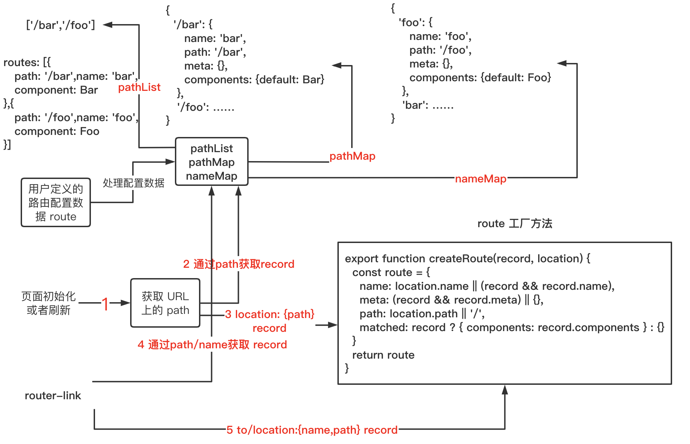
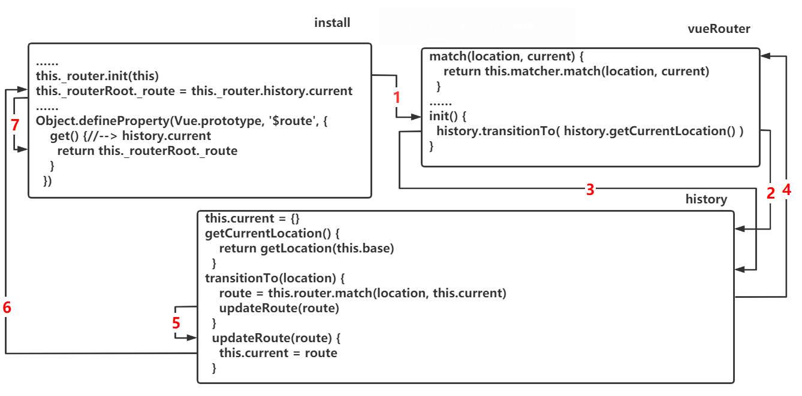

# `vue-router` 简单功能实现

## 使用例子
```js{3,4,9,10}
import Vue from 'vue'
import App from './App.vue'
import VueRouter from '../router/index'
import route from './route'

Vue.config.productionTip = false

//
Vue.use(VueRouter)
const router = new VueRouter(route)

new Vue({
  router,
  render: h => h(App),
}).$mount('#app')
```
平时我们在项目开发中使用 `vue-router` 都会这样配置，那么他的内部代码是怎样的呢？让我们一步一步揭开它的神秘面纱吧

## VueRouter
我们先上代码: `../router/index`
```js
import { install } from './install'
export default class VueRouter {
  constructor() {
  }
}
//
VueRouter.install = install // install方法
VueRouter.version = '__VERSION__' // 版本

// 如果是浏览器环境，并且有 window.Vue 则直接运行 Vue.use(VueRouter)
if (inBrowser && window.Vue) {
  window.Vue.use(VueRouter)
}
```
从代码可以看出 `vueRouter` 是一个 `class`, 并且在 `class` 上定义了一个 `install` 方法。当我们 `Vue.use(VueRouter)` 的时候，其实是执行了他的 `install` 方法。`vue` 的插件安装方式
```js{1,4}
import VueRouter from '../router/index'
…………
//
Vue.use(VueRouter)
const router = new VueRouter(route)
new Vue({
  router,
  render: h => h(App),
}).$mount('#app')
```
那么 `install.js` 文件又做了什么呢？

## install.js
```js{14,15}
import View from './components/view'
import Link from './components/link'

export let _Vue //这里暴露Vue,其他地方可以直接引用，无需再次 import vue from 'vue'

export function install(Vue) {
  //表示路由插件已经安装，无需再次安装，确保install方法只调用一次
  if (install.installed && _Vue === Vue) return
  install.installed = true

  _Vue = Vue

  //注册全局组件
  Vue.component('RouterView', View)
  Vue.component('RouterLink', Link)
}
```
代码很简洁，而且很容易看懂，最主要的功能就是注册了两个全局的组件: `RouterView` `RouterLink`

## $router 与 $route
`RouterView` `RouterLink` 之后会介绍，我们先搞清楚平时用的很多的  `$router` 与 `$route` 

`install.js` 文件添加一些代码
```js{8-17}
export function install(Vue) {
  //表示路由插件已经安装，无需再次安装，确保install方法只调用一次
  if (install.installed && _Vue === Vue) return
  install.installed = true

  _Vue = Vue
  //
  Object.defineProperty(Vue.prototype, '$router', {
    get() {
      return ？？？
    }
  })
  Object.defineProperty(Vue.prototype, '$route', {
    get() {
      return ？？？
    }
  })
  //注册全局组件
  Vue.component('RouterView', View)
  Vue.component('RouterLink', Link)
}
```
注意深色部分代码，在实例原型上创建了他们，难怪我们在 `vue` 实例中都可以用 `this` 来获取这些变量，那么返回的值是什么呢？
### $router
`$router` 就是 `vueRouter` 创建的实例 `this`，而且还定义了一些实例方法
```js{4}
import { install } from './install'
export default class VueRouter {
  constructor() {
    // this
  }
  push() {}
  replace() {}
  go() {}
  back() {}
  forward() {}
  ……
}
```
那么怎么才能在每个 `vue` 的实例上获取到 `VueRouter` 实例呢？
```js{3}
 Object.defineProperty(Vue.prototype, '$router', {
    get() {
      return ？？？ //  new vueRouter(route)
    }
  })
```
我们平时写的代码
```js{1,3}
const router = new VueRouter(route)
new Vue({
  router,
  render: h => h(App),
}).$mount('#app')
```
我们创建的 `VueRouter` 实例对象放在了 `vue` 根实例的 `options` 里面
```js
app(根实例).options.router //VueRouter 实例对象
```
::: tip 解析
如果每个 `vue` 实例上都挂载了根实例，就可以通过根实例获取到 `VueRouter` 实例对象
:::
install.js 增加了一些代码，请看代码里面的注释
```js{9-21,25}
export function install(Vue) {
  //表示路由插件已经安装，无需再次安装，确保install方法只调用一次
  if (install.installed && _Vue === Vue) return
  install.installed = true

  _Vue = Vue
  const isDef = v => v !== undefined
  // 为什么用混入，因为混入，每个vue实例都会执行这段代码，在这里就可以获取到每个vue实例
  Vue.mixin({
    beforeCreate() {
      //这里的this就是每个页面的实例,我们需要为每个实例挂载_router,以便在下面定义的$router
      //可以在实例中获取，第一步是获取根实例，因为根实例上有 new Router(route)实例对象，
      //然后把根实例全部挂到子实例中
      if (isDef(this.$options.router)) {//根实例
        this._routerRoot = this // this._routerRoot._router -> this.$options.router
        this._router = this.$options.router
      } else {//其他子实例
        this._routerRoot = (this.$parent && this.$parent._routerRoot) || this
      }
    }
  })
  //
  Object.defineProperty(Vue.prototype, '$router', {
    get() {
      return this._routerRoot._router
    }
  })
  Object.defineProperty(Vue.prototype, '$route', {
    get() {
      return ？？？
    }
  })
  //注册全局组件
  Vue.component('RouterView', View)
  Vue.component('RouterLink', Link)
}
```
所以在每个 `vue` 的实例上都挂在了一个变量 `_routerRoot`（`vue` 根实例）
::: tip 解析
关于 `17` 行代码，是不是有人会疑惑为什么只判断了上一层的$parent，而不是一直往上递归判断？
这是由于父子实例的执行顺序决定的：根实例，根的子实例A，A的子实例B，B的子实例C…………
如果C的父没有，那么一直到根实例都会没有，所以只要往上判断一层就可以，无需一直判断
:::

### $route
`$route` 也可以像 `$router` 的原理一样实现，不过我们先看 `$route` 到底是什么?

[官方介绍 $route](https://router.vuejs.org/zh/api/#%E8%B7%AF%E7%94%B1%E5%AF%B9%E8%B1%A1)
::: tip 说明
一个路由对象 (route object) 表示当前激活的路由的状态信息，包含了当前 URL 解析得到的信息，还有 URL 匹配到的路由记录 (route records)
:::
```js
const route = {
  name: 'bar', // 路由配置信息中定义的name
  path: '/bar',// 路由配置信息中定义的path
  meta: {},// 路由配置信息中定义的meta
  matched: { components: {default: Bar} }// path对应的要展示的组件
  …………
}
```
`route` 大致长这样，不过还有很多属性没有展示出来，在之后的内容中会一一讲解

我们通过一张流程图来介绍在 `vue-router` 中 `route` 是怎样产生了


我们简单分析下：
+ 通过我们传入的路由配置数据 `route`，可以构造出 `pathList,pathMap,nameMap`
+ 页面刷新或者初始化时，可以通过浏览器的 `url` 获取到 `path` 
+ `pathMap[path]` 获取到匹配的 `record`，通过路由工厂方法返回路由 `route`
+ 路由跳转还可以用 `router-link`( push方法 )来完成，参数可能是 `name` 或者 `path` 
+ `pathMap[path]` 或者 `nameMap[name]` 获取到匹配的 `record`，通过路由工厂方法返回路由 `route`

接下来我们一步一步实现，首先看看页面刷新或者初始化方法 `init` ，他应该只执行一次，可以放在混入 `mixin` 的根实例判断那里，确保只执行一次
```js{17-18}
export function install(Vue) {
  //表示路由插件已经安装，无需再次安装，确保install方法只调用一次
  if (install.installed && _Vue === Vue) return
  install.installed = true

  _Vue = Vue
  const isDef = v => v !== undefined
  // 为什么用混入，因为混入，每个vue实例都会执行这段代码，在这里就可以获取到每个vue实例
  Vue.mixin({
    beforeCreate() {
      //这里的this就是每个页面的实例,我们需要为每个实例挂载_router,以便在下面定义的$router
      //可以在实例中获取，第一步是获取根实例，因为根实例上有 new Router(route)实例对象，
      //然后把根实例全部挂到子实例中
      if (isDef(this.$options.router)) {//根实例
        this._routerRoot = this // this._routerRoot._router -> this.$options.router
        this._router = this.$options.router
        //这里确保页面初始化只会执行一次，init放在了new Router(route)实例对象上
        this._router.init(this) //this为根实例
      } else {//其他子实例
        this._routerRoot = (this.$parent && this.$parent._routerRoot) || this
      }
    }
  })
  …………
}
```
`init` 方法
```js{5,7-10}
export default class VueRouter {
  constructor(options) {
    this.app = null //根实例
    this.options = options //new的时候传入的配置信息
    this.history = new History(this, options.base)
  }
  init(app) {
    if (this.app) return
    this.app = app
  }
  ……
}
```
`init` 方法的目的是要获取当前路由信息，我们把当前路由信息变量 `current` 放入 `History Class` 中。并且加入了通过 `url` 获取 `path` 的方法 `getCurrentLocation`

```js{6-7,9-11}
export class History {
  constructor(router, base) {
    //路由实例对象
    this.router = router //$router
    //基本路径
    this.base = normalizeBase(base) //需要标准化base
    this.current = {} //定义匹配后的路由对象
  }
  getCurrentLocation() {//通过 url 获取 path 的方法，这里的path是包含hash和query的
    return getLocation(this.base)
  }
}
// 标准化base
function normalizeBase(base) {
  if (!base) {
    if (inBrowser) {//html中有<base href="/base">, 就把值当作base
      // respect <base> tag
      const baseEl = document.querySelector('base')
      base = (baseEl && baseEl.getAttribute('href')) || '/'
      // strip full URL origin
      // eslint-disable-next-line no-useless-escape
      base = base.replace(/^https?:\/\/[^\/]+/, '')
    } else {
      base = '/'
    }
  }
  // make sure there's the starting slash 确保开始是 /
  if (base.charAt(0) !== '/') {
    base = '/' + base
  }
  // remove trailing slash 删掉最后的 /
  return base.replace(/\/$/, '')
}
// www.shengrongchun.com/pathname?search=123#hash=111
export function getLocation(base) {//获取url的path
  //
  let path = decodeURI(window.location.pathname) // /pathname
  if (base && path.toLowerCase().indexOf(base.toLowerCase()) === 0) {
    path = path.slice(base.length) // path中有base去掉
  }
  // /pathname?search=123#hash=111
  return (path || '/') + window.location.search + window.location.hash
}
```
::: tip
代码很简单，而且重要的地方都有注释，就不解析了
:::
现在我们有了当前路由信息 `current` 了，虽然他还是空对象。不过我们可以回看下 `install.js`，添加了一些深底的代码
```js{19,33}
export function install(Vue) {
  //表示路由插件已经安装，无需再次安装，确保install方法只调用一次
  if (install.installed && _Vue === Vue) return
  install.installed = true

  _Vue = Vue
  const isDef = v => v !== undefined
  // 为什么用混入，因为混入，每个vue实例都会执行这段代码，在这里就可以获取到每个vue实例
  Vue.mixin({
    beforeCreate() {
      //这里的this就是每个页面的实例,我们需要为每个实例挂载_router,以便在下面定义的$router
      //可以在实例中获取，第一步是获取根实例，因为根实例上有 new Router(route)实例对象，
      //然后把根实例全部挂到子实例中
      if (isDef(this.$options.router)) {//根实例
        this._routerRoot = this // this._routerRoot._router -> this.$options.router
        this._router = this.$options.router
        //这里确保页面初始化只会执行一次，init放在了new Router(route)实例对象上
        this._router.init(this) //this为根实例
        this._route = this._router.history.current
      } else {//其他子实例
        this._routerRoot = (this.$parent && this.$parent._routerRoot) || this
      }
    }
  })
  //
  Object.defineProperty(Vue.prototype, '$router', {
    get() {
      return this._routerRoot._router
    }
  })
  Object.defineProperty(Vue.prototype, '$route', {
    get() {
      return this._routerRoot._route
    }
  })
  //注册全局组件
  Vue.component('RouterView', View)
  Vue.component('RouterLink', Link)
}
```
`init` 方法执行完后，接着就是把 `current` 赋值给了根实例的 `_route`。然后就是
```js{3}
Object.defineProperty(Vue.prototype, '$route', {
  get() {
    return this._routerRoot._route
  }
})
```
`init` 方法执行不仅是创建空对象 `current` 还需要给 `current` 赋匹配路由信息值。我们在 `VueRouter` 代码中加入了一些代码
```js{5,8-10,15-16}
export default class VueRouter {
  constructor(options) {
    this.app = null //根实例
    this.options = options //new的时候传入的配置信息
    this.matcher = createMatcher(options.routes || [], this)
    this.history = new History(this, options.base)
  }
  match(location, current) {//通过location获取匹配的route
    return this.matcher.match(location, current)
  }
  init(app) {
    if (this.app) return
    this.app = app
    //
    const history = history
    history.transitionTo( history.getCurrentLocation() )
  }
  ……
}
```
我们在 `History` 上添加路由改变方法 `transitionTo` 与 `updateRoute`
```js{12-18}
export class History {
  constructor(router, base) {
    //路由实例对象
    this.router = router //$router
    //基本路径
    this.base = normalizeBase(base) //需要标准化base
    this.current = {} //定义匹配后的路由对象
  }
  getCurrentLocation() {//通过 url 获取 path 的方法，这里的path是包含hash和query的
    return getLocation(this.base)
  }
  transitionTo(location) {
    route = this.router.match(location, this.current)
    updateRoute(route)
  }
  updateRoute(route) {
    this.current = route 
  }
}
…………
```

::: tip
先不管 `createMatcher` 是什么，我们现在只要知道，`this.matcher` 对象中有 `match` 方法
`this.matcher.match(location, current)` 会返回我们需要的路由对象
:::

目前 `_route(history.current)` 运转流程图


## match 方法
```js
this.matcher = createMatcher(options.routes || [], this)
……
return this.matcher.match(location, current)
```
它会返回我们匹配成功的路由信息，我们来看看他是怎么实现的。先看几个方法，`createMatcher Class` 会用到

### normalizeLocation
```js
//浅copy
export function extend(a, b) {
  for (const key in b) {
    a[key] = b[key]
  }
  return a
}
//从path中解析出单纯的 path hash query
export function parsePath(path) {
  let hash = ''
  let query = ''
  // path: /a?b=1#c=2
  const hashIndex = path.indexOf('#')
  if (hashIndex >= 0) {
    hash = path.slice(hashIndex) // #c=2
    path = path.slice(0, hashIndex) // /a?b=1
  }
  const queryIndex = path.indexOf('?')
  if (queryIndex >= 0) {
    query = path.slice(queryIndex + 1) // b=1
    path = path.slice(0, queryIndex) // /a
  }
  return {
    path,
    query,
    hash
  }
}
export function normalizeLocation(
  raw,
  current
) {
  // raw可能是字符串如在url上获取的path,也可能是 <router-link :to={path:/bar,……} /> 的to
  let next = typeof raw === 'string' ? { path: raw } : raw
  if (next._normalized) {//已经有标准化后的标识直接返回
    return next
  } else if (next.name) { // 如果有name
  // 不希望用户传入的raw和源码内部之间相互影响，所以用了浅copy,raw中没有像对象，数组这样类型的值，所以也就相当于深copy
    next = extend({}, raw) 
    return next
  }
  //解析 path hash query  主要是path有可能会有hash,query
  const parsedPath = parsePath(next.path || '')
  const path = parsedPath.path
  return {
    _normalized: true,
    path
  }
}
```
## createMatcher
```js{5,15-16,18-19,28}
export function createMatcher(
  routes,
  router
) {
  // createRouteMap先不需要知道是什么，只要知道他返回了 pathList, pathMap, nameMap
  const { pathList, pathMap, nameMap } = createRouteMap(routes)
  //
  function match(
    raw,
    currentRoute
  ) {
    const location = normalizeLocation(raw, currentRoute, false, router)
    const { name, path } = location
    if(name) {
      const record = nameMap[name]
      return _createRoute(record, location)
    }else if(path){
      const record = pathMap[path]
      return _createRoute(record, location)
    }
    return _createRoute(null, location)
  }
  //
  function _createRoute(
    record,
    location,
  ) {
    return createRoute(record, location)
  }
  //
  return {
    match
  }

}
```
整个代码的功能就是获取匹配的 `record` 和 `location` 一起作为参数传入 `createRoute` 方法返回 `route`

## createRoute
```js
export function createRoute(
  record,
  location
) {
  const route = {
    name: location.name || (record && record.name),//当前路由的名称，如果有的话
    meta: (record && record.meta) || {},//meta元数据，如果有的话
    //字符串，对应当前路由的路径，总是解析为绝对路径，如 "/foo/bar"
    path: location.path || '/',
    //当前路由匹配的组件
    matched: {components: record.components}
  }
  //
  return Object.freeze(route)//冻结对象，不让其修改
}
```
既然有了创建路由的工厂方法了，我们就再加一个初始化路由常量 `START`
```js
// the starting route that represents the initial state
export const START = createRoute(null, {
  path: '/'
})
```
开始的路由空对象设置成 `START`
```js
this.current = {} --> this.current = START
```
## createRouteMap
最后让我们来看看 `createRouteMap` 到底是如何返回 `pathList,pathMap,nameMap`

cleanPath
```js
//把path中 '//' --> '/'
export function cleanPath(path) {
  return path.replace(/\/\//g, '/')
}
```
createRouteMap
```js
import { cleanPath } from './util/path'
import { assert, warn } from './util/warn'
export function createRouteMap(
  routes
) {
  const pathList = [] //创建空数组
  const pathMap = Object.create(null)//创建空对象
  const nameMap = Object.create(null)//创建空对象
  //遍历 routes 把 route 相关信息放入 pathList, pathMap, nameMap
  routes.forEach(route => {
    addRouteRecord(pathList, pathMap, nameMap, route)
  })
  //
  return {
    pathList,
    pathMap,
    nameMap
  }
}
function addRouteRecord(
  pathList,
  pathMap,
  nameMap,
  route,
) {
  const { path, name } = route
  if (process.env.NODE_ENV !== 'production') {//非生产环境警告，配置信息path是必须的
    assert(path != null, `"path" is required in a route configuration.`)
    assert(//非生产环境警告，component不能是字符串，必须是一个真实的组件
      typeof route.component !== 'string',
      `route config "component" for path: ${String(
        path || name
      )} cannot be a ` + `string id. Use an actual component instead.`
    )
  }
  const pathToRegexpOptions =
    route.pathToRegexpOptions || {}
  //标准化path
  const normalizedPath = normalizePath(path, null, pathToRegexpOptions.strict)
  const record = {
    path: normalizedPath,
    components: route.components || { default: route.component },
    name,
    meta: route.meta || {},
  }
  //去掉重复的path定义
  if (!pathMap[record.path]) {
    pathList.push(record.path)
    pathMap[record.path] = record
  }
  //
  if (name) {
    if (!nameMap[name]) {
      nameMap[name] = record
    } else if (process.env.NODE_ENV !== 'production') {
      warn(//非生产环境警告，配置信息name不能重复
        false,
        `Duplicate named routes definition: ` +
        `{ name: "${name}", path: "${record.path}" }`
      )
    }
  }
}
// 标准化path
function normalizePath(
  path,
  parent,
  strict
) {
  if (!strict) path = path.replace(/\/$/, '') // 非严格模式会去掉path最后的 /
  if (path[0] === '/') return path
  if (parent == null) return path
  return cleanPath(`${parent.path}/${path}`)
}
```
::: tip
遍历传入的路由配置数据，把相关数据信息存入 `pathList, pathMap, nameMap` 中。这段代码没有什么注释，因为只要耐心看，就很容易看懂
:::

例子
```js
const route = [
  {
    path: '/bar',
    name: 'bar',
    meta: {},
    component: Bar
  },
  {
    path: '/foo',
    name: 'foo',
    meta: {},
    component: Foo
  },
]
//转化后
const pathList = ['/bar','/foo']
const pathMap = {
  '/bar': {
    path: '/bar',
    name: 'bar',
    meta: {},
    component: Bar
  },
  ……
}
const nameMap = {
  'bar': {
    path: '/bar',
    name: 'bar',
    meta: {},
    component: Bar
  },
  ……
}
```
## push 方法
还记得在项目中是怎么使用 `push` 方法的吗？
```js
this.$router.push({
  name: '***',
  path: '***',
  ****
})
```
所以 `push` 方法是挂载 `vueRouter` 实例对象上
```js{18-20}
export default class VueRouter {
  constructor(options) {
    this.app = null //根实例
    this.options = options //new的时候传入的配置信息
    this.matcher = createMatcher(options.routes || [], this)
    this.history = new History(this, options.base)
  }
  match(location, current) {//通过location获取匹配的route
    return this.matcher.match(location, current)
  }
  init(app) {
    if (this.app) return
    this.app = app
    //
    const history = history
    history.transitionTo( history.getCurrentLocation() )
  }
  push(location) {
    history.transitionTo( location )
  }
  ……
}
```
从代码可以看出，内部也是执行了 `transitionTo` 最终改变了 `history.current`

我们之前有过 `this._routerRoot._route = this._router.history.current`，那么`current` 改变了 `_route` 会跟着变吗？

当然不会，所以我们还要加一些代码
```js{18-20}
export default class VueRouter {
  constructor(options) {
    this.app = null //根实例
    this.options = options //new的时候传入的配置信息
    this.matcher = createMatcher(options.routes || [], this)
    this.history = new History(this, options.base)
  }
  match(location, current) {//通过location获取匹配的route
    return this.matcher.match(location, current)
  }
  init(app) {
    if (this.app) return
    this.app = app
    //
    const history = history
    history.transitionTo( history.getCurrentLocation() )
    //
    history.listen(route => {
      app._route = route // app 是根实例相当于 this._routerRoot._route = route
    })
  }
  push(location) {
    history.transitionTo( location )
  }
  ……
}
```
我们给 `History` 的 `listen` 方法传入了函数，这个函数的功能是改变 `this._routerRoot._route`

再看看 `listen` 
```js{16-18,21}
export class History {
  constructor(router, base) {
    //路由实例对象
    this.router = router //$router
    //基本路径
    this.base = normalizeBase(base) //需要标准化base
    this.current = {} //定义匹配后的路由对象
  }
  getCurrentLocation() {//通过 url 获取 path 的方法，这里的path是包含hash和query的
    return getLocation(this.base)
  }
  transitionTo(location) {
    route = this.router.match(location, this.current)
    updateRoute(route)
  }
  listen(cb) {
    this.cb = cb
  }
  updateRoute(route) {
    this.current = route 
    this.cb && this.cb(route) // 去改变 实例的_route
  }
}
…………
```
::: tip 解析
初始化或者页面刷新的时候，还没有 `this.cb`，当第二次以及之后执行 `transitionTo updateRoute`，就会有然后执行 `this.cb` 改变 `app._route`。为什么初始化还没有 `this.cb`，请看下面的代码
:::
```js{6,8}
init(app) {
  if (this.app) return
  this.app = app
  //
  const history = history
  history.transitionTo( history.getCurrentLocation() )
  //
  history.listen(route => {
    app._route = route // app 是根实例相当于 this._routerRoot._route = route
  })
}
……
```
`init` 中执行的顺序已经非常清晰了，初始化执行完 `transitionTo` 后，才执行 `listen` 传 `cb`
## 多app共用一个vueRouter场景
我们很少会像下面这样使用路由，但 `vue-router` 支持这样的场景
```js
//
Vue.use(VueRouter)
const router = new VueRouter(route)

//实例1
new Vue({
  router,
  render: h => h(App1),
}).$mount('#app1')
//实例2
new Vue({
  router,
  render: h => h(App2),
}).$mount('#app2')
```
::: tip 解析
使用 `this.apps` 装入这些 `app`，然后轮询处理赋值 `app._route = route`
:::
```js{4,13,21-23}
export default class VueRouter {
  constructor(options) {
    this.app = null //根实例
    this.apps = [] //存放多个根实例
    this.options = options //new的时候传入的配置信息
    this.matcher = createMatcher(options.routes || [], this)
    this.history = new History(this, options.base)
  }
  match(location, current) {//通过location获取匹配的route
    return this.matcher.match(location, current)
  }
  init(app) {
    this.apps.push(app)
    if (this.app) return
    this.app = app
    //
    const history = history
    history.transitionTo( history.getCurrentLocation() )
    //
    history.listen(route => {
      this.apps.forEach((app)=> {
        app._route = route // app 是根实例相当于 this._routerRoot._route = route
      })
    })
  }
  push(location) {
    history.transitionTo( location )
  }
  ……
}
```
`route` 改变，多个 `vue` 实例都会跟着 `render` 。如果你有这样的场景，就大胆的用起来吧
## router-link 组件
组件是通过 `render` 函数生成。请自行去查阅 `render` 函数知识点
```js{7,23,30}
// work around weird flow bug
const toTypes = [String, Object]
const eventTypes = [String, Array]
export default {
  name: 'RouterLink',
  props: {
    to: {
      type: toTypes,
      required: true
    },
    tag: {
      type: String,
      default: 'a'
    },
    event: {
      type: eventTypes,
      default: 'click'
    }
  },
  render(h) {
    const router = this.$router
    const current = this.$route
    const { location } = router.resolve(
      this.to,
      current,
    )
    const data = {
      on: {
        click: () => {
          router.push(location)
        }
      }
    }
    return h(this.tag, data, this.$slots.default)
  }
}
```
::: tip 解析
代码并不复杂，就是点击触发 `push` 方法，`to` 是我们传入的参数，需要转为 `location` 我们需要在 `History` 中增加 `resolve` 方法转换
:::
## resolve
```js{30-44}
export default class VueRouter {
  constructor(options) {
    this.app = null //根实例
    this.apps = [] //存放多个根实例
    this.options = options //new的时候传入的配置信息
    this.matcher = createMatcher(options.routes || [], this)
    this.history = new History(this, options.base)
  }
  match(location, current) {//通过location获取匹配的route
    return this.matcher.match(location, current)
  }
  init(app) {
    this.apps.push(app)
    if (this.app) return
    this.app = app
    //
    const history = history
    history.transitionTo( history.getCurrentLocation() )
    //
    history.listen(route => {
      this.apps.forEach((app)=> {
        app._route = route // app 是根实例相当于 this._routerRoot._route = route
      })
    })
  }
  push(location) {
    history.transitionTo( location )
  }
  //router-link 组件中用到，获取location-->push-->transitionTo
  resolve(
    to,
    current
  ) {
    current = current || this.history.current
    const location = normalizeLocation(
      to,
      current
    )
    return {
      location
    }
  }
  ……
}
```
`normalizeLocation` 方法之前有提到过，这里不再赘述

## router-view 组件
```js{14,20}
export default {
  name: 'RouterView',
  functional: true, // vue的函数式组件
  props: {
    name: {
      type: String,
      default: 'default'
    },
  },
  render(_, { props, children, parent, data }) {
    //
    const h = parent.$createElement
    const name = props.name
    const route = parent.$route //组件依赖了$route
    const matched = route.matched
    const component = matched && matched.components[name]
    if (!matched || !component) {
      return h()
    }
    return h(component, data, children)
  }
}
```
代码是不是比想象中简单，如果不清楚函数式组件可以自行去查阅资料。`component` 是我们路由配置数据传入的组件
::: tip
我们看 `14` 行代码，`render` 函数中依赖了此变量，当这个变量是响应式的。如果此变量变化了，`render` 函数就会重新执行。
这是我们希望看到的，因为当前路由的变化，我们就希望 `router-view` 渲染对应的组件
:::
我们需要把 `$route` 变成响应式的，这个也不难
```js{14-15}
export function install(Vue) {
  ……
  // 为什么用混入，因为混入，每个vue实例都会执行这段代码，在这里就可以获取到每个vue实例
  Vue.mixin({
    beforeCreate() {
      //这里的this就是每个页面的实例,我们需要为每个实例挂载_router,以便在下面定义的$router
      //可以在实例中获取，第一步是获取根实例，因为根实例上有 new Router(route)实例对象，
      //然后把根实例全部挂到子实例中
      if (isDef(this.$options.router)) {//根实例
        this._routerRoot = this // this._routerRoot._router -> this.$options.router
        this._router = this.$options.router
        //这里确保页面初始化只会执行一次，init放在了new Router(route)实例对象上
        this._router.init(this) //this为根实例
        //this._route = this._router.history.current
        Vue.util.defineReactive(this, '_route', this._router.history.current)
      } else {//其他子实例
        this._routerRoot = (this.$parent && this.$parent._routerRoot) || this
      }
    }
  })
  ……
}
```
::: tip
代码由 `14` 行变成了 `15` 行。响应式不仅解决了重新渲染对应组件的问题，而且还使得我们可以在项目中监听 `$route`。
因为监听变量的前提是变量是响应式的
:::
```js
watch: {
  $route() {
    ……
  }
}
```
## 总结
一个简单的路由终于实现了，如果还是觉得思路很乱。可以访问 `github` 查看相关代码（求Star），建议下载下来调试
[这里附上github代码地址,请把分支切到 stage-0 查看](https://github.com/shengrongchun/parse-vue-router)

