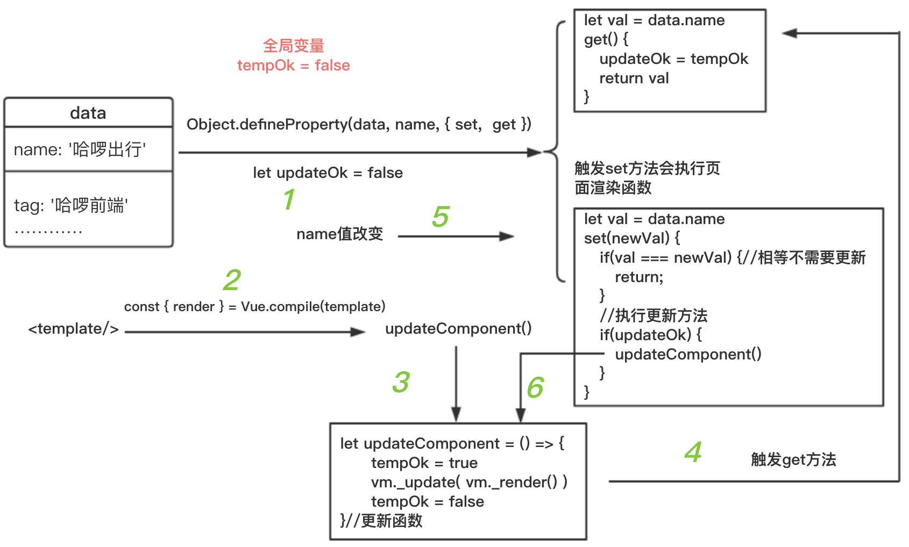

# 响应式原理
<!-- 我并不想一开始就去跟随源码来一步一步的讲解`vue`,原因有以下几点:
- 读者没有了解vue的整个架构，跟随看源码看会云里雾里
- 对源码的讲解，可能自己表达力不够
- 网上分析源码的文章很多 -->
## template 到 DOM
接触 `vue` 框架的开发者都了解，我们有两种方式写 `'html'`
- 通过 `template` 的方式
- 通过 `render` 函数的方式

如果是通过 `template` 的方式，最终还是要转为 `render` 函数。
小提示: `vue` 的版本有几种，如不带编译的版本（无 `template` 转 `render` 函数功能）。我们平时大多使用这种版本。不是因为我们不写 `template`, 而是我们的 `template` 都会写在`.vue` 的文件中。而 `.vue` 的文件是通过 `vue-loader` 加载器加载的。`vue-loader` 本身会有模板编译 `render` 函数的功能。

```html
<div id="app"></app>
```
```js
import Vue from 'vue'
new Vue({
  el: '#app', //寻找创建出来的DOM模板插入哪里
  template:'<span @click="changeName">{{ name }}</span>' //渲染的模板
  data() {
    return {
      name: '哈啰出行,点我试试!'
    }
  },
  methods: {
    changeName() {
      this.name = '哈啰出行，我看行'
    }
  }
});
```
<demo-1 />
`Vue` 中有个叫 `compile` 的编译函数, 此函数会把 `template` 编译成 `render` 函数，如以下的精简版:
````html
template
<span @click="changeName">{{ name }}</span>
````
````js
const { render } = Vue.compile(template)
vm._render = render
render--> () {
  return with(this){//如果直接vm._render()执行的话 this就是vm
    return _c('span',
      {
        on:{"click": changeName}
      },
      [
        _v( _s(name) )
      ]
    )
  }
}
````
执行 `vm._render` 函数的过程中会获取 `name` 的值（如果定义数据劫持，会触发 `get` 方法），返回 `vnode`。`vnode` 会传给 `vm._update` 方法更新 `vm.$el` 而 `vm.$el` 是 `#app` 的引用。
````html
<div id="app"></app>
````
````js
 vm.$el = el = document.querySeletor('#app')
````
所以当我们更改 `vm.$el` 页面就会随之改变, 而 `vm._update` 函数就是改变 `vm.$el`
````js
Vue.prototype._update = function (vnode) {
  const vm = this
  const prevEl = vm.$el
  const prevVnode = vm._vnode
  vm._vnode = vnode
  // Vue.prototype.__patch__ is injected in entry points
  // based on the rendering backend used.
  if (!prevVnode) {
    // 初始化渲染
    vm.$el = vm.__patch__(vm.$el, vnode, false, false /* removeOnly */)
  } else {
    // 更新渲染
    vm.$el = vm.__patch__(prevVnode, vnode)
  }
}
````
这里的 `vm.__patch__` 函数是通过 `diff` 算法对新旧 `vnode` 比较，更新 `$el`。而初始化阶段只是创建 `$el`。具体详情不在这里讨论
#### 现在我们知道只要执行 `vm._update(vm._render())` 页面就会立即更新渲染
我们可以把其封装在一个名叫 `updateComponent` 的函数中
````js
let updateComponent = () => {
  vm._update( vm._render() )
}
````
当每次需要执行页面更新渲染的时候，执行此函数即可。
## `name` 值改变重新渲染
当 `name` 值改变时，我们需要重新渲染页面，所以我们要对 `name` 进行数据劫持。当触发其 `set` 方法时, 执行 `updateComponent` 函数。如下流程图所示:

整个初次渲染和更新渲染功能已经完成。不过还有很多问题
````js
[1,2,3,……].forEach((item)=> {
  this.name = item
})
````
- 要是循环给 `name` 值赋值 `n` 次，那么是不是要执行 `n` 次更新
- 如果知道哪次赋值是最后触发 `set` 方法的，直接执行那次的更新函数不就行了？

对于以上问题，可以通过 `微任务` 或者 `宏任务` 的方式来解决，如果不清楚可以搜索浏览器的 `event loop` 来了解原理。大致原理就是 `set` 函数也是 `js` 的主程序。当主程序执行完毕后，会去执行微任务然后再宏任务。当把更新函数放在微任务（ `promise` 等）或者宏任务（ `setTimeout` 等）里面执行, 此时 `js` 的主程序已经执行完毕（所有的 `set` 触发），并且相关值（ `name` ）已经为最新值。此时执行更新函数可以获取最新值并且只执行一次。

假设此时的浏览器支持微任务 `promise` 定义如下函数 `timerFunc`
````js
const p = Promise.resolve()
let timerFunc = () => {
  p.then(updateComponent);
}
````
`set` 函数直接去执行 `timerFunc` 函数，会创建很多个 `promise` 微任务，导致还是会渲染更新很多次（虽然每次更新都是最新值）。所以设置一个中间函数 `renderUpdate`
````js
let waiting = false;
const p = Promise.resolve()
//
let timerFunc = () => {
  p.then(updateComponent);
}
//
function renderUpdate() {
  if(!waiting) {
    waiting = true;
    timerFunc();
  }
}
````
这样就保证了只会执行一次 `timerFunc`。但是新的问题出现了，`n` 次的数据变化已经得到了更新。但是页面更新后再次数据变化，由于 `waiting` 永远都是 `true` 无法再执行 `timerFunc` 函数更新页面。所以在 `updateComponent` 函数执行后，应该重新设置 `waiting`为 `false`。
````js
let waiting = false;
const p = Promise.resolve()
//
let timerFunc = () => {
  p.then(()=> {
    updateComponent();
    waiting = false;
  });
}
//
function renderUpdate() {
  if(!waiting) {
    waiting = true;
    timerFunc();
  }
}
````
改变后的流程图

似乎这样就完美解决了问题。不过细想一下又有个问题出现了，看如下代码
````html
<span @click="changeName">{{name}}</span>
````
````js
data() {
  return {
    name: '哈啰出行',
    tag: '哈啰前端'
  }
}
````
当去触发 `name` 的 `set` 方法时会更新页面，而当触发 `tag` 的 `set` 方法时也会更新页面。此时的更新页面根本是多余，因为 `template` 模板中没有出现 `tag`。
#### 怎么知道哪些触发 `set` 方法时要更新，哪些不用呢？
在页面第一次初始化渲染的时候执行了 `render` 函数。函数的执行会触发所有在 `template` 模板中定义的变量（ `name` 等）的 `get` 方法。因此可以利用 `get` 方法来设置是否在触发 `set` 方法的时候执行更新。

每个 `data` 里面的数据变量都需要一个标识判断是否在 `set` 方法中执行更新函数。假如这个标识叫 `updateOk`，而仅仅靠是否触发 `get` 函数就判断是否可以执行更新方法似乎不够，如
````js
created() {
  const temp = this.tag;
}
````
在 `created` 方法中触发了 `tag` 的 `get` 方法，然而 `tag` 的改变并不需要更新页面。所以 `updateOk` 的值应该在 `render` 函数的执行前后变化着。`tempOk` 为全局变量，如
````js
let val = data.tag
get() {
  updateOk = tempOk
  return val
}
````
````js
let updateComponent = () => {
  tempOk = true
  vm._update( vm._render() )
  tempOk = false
 }//更新函数
````
改变后的流程图


## watch 监听的实现
看如下代码
````js
{
  data() {
    return {
      name: '哈啰出行'
    }
  },
  watch: {
    name: function handler(newVal, oldVal)=> {
      console.log(newVal)
    }
  }
}
````
`watch` 功能是监听当 `name` 的值发生变化的时候执行 `watch.name` 对应的 `handler` 方法，方法的参数是新旧值。分析功能有以下几点
- 触发 `name` 的 `set ` 方法时要执行 `handler` 函数
- 要保存新旧值给 `handler` 函数当参数。

以下代码是对 `watch` 的 `key` 如 `name` 获取其值的包装函数
````js
const bailRE = new RegExp(`[^${unicodeRegExp.source}.$_\\d]`)
function parsePath (path) {//例如 name、a.b、a.b.c……
  if (bailRE.test(path)) {
    return
  }
  const segments = path.split('.')
  return function (obj) {
    for (let i = 0; i < segments.length; i++) {
      if (!obj) return
      obj = obj[segments[i]]
    }
    return obj
  }
}
var getter = parsePath(watchKey)
var oldVal = getter.call(vm, vm) //旧值的获取
````
`parsePath` 函数的功能是返回一个函数，此函数的是获取监听表达式的值，`obj` 是 `vm`，在`vm` 上获取值。再次包装一下获取值的函数，起名叫 `getWVal`
````js
let getWVal = (vm, watchKey, handler)=> {
  let getter = parsePath(watchKey)
  let oldVal = getter.call(vm, vm) //旧值的获取
}
````
当获取 `name` 值触发 `get` 方法时，需要在 `get` 方法中记住 `handler` 函数和旧值 `oldVal`。我们需要在数据劫持部分为每个 `key` 增加属于自己的两个变量：`watchHandler` 和`wOldVal`，以便在触发 `set` 方法中使用。我们要把 `handler` 函数赋值给一个全局变量 `Handler`，`watch` 的流程图如下

以下代码输出的结果是什么？

````js
{
  data() {
    return {
      a: {
        b: 111
      }
    }
  },
  watch: {
    'a.b': function handler1(newval, oldVal) {
      console.log(newval);
    },
    a: function handler2(newval, oldVal) {
      console.log(newval);
    }
  },
  mounted() {
    this.a = 222
  }
}
````
按照以上所描述的流程图，在解析 `a.b` 会同时触发 `a` 的 `get` 方法和 `b` 的 `get` 方法。
此时 `a` 已经收集了 `handler1` 函数。当再次解析下一个 `watch`  `a` 的时候，又会触发 `a` 的 `get` 方法，重新赋值 `handler2` 函数。所以虽然触发了两次 `get` 方法，但只会收集 `hander2` 函数。最终的结果是

`222`

很遗憾的是 `Vue` 保留了两者，结果是

`undefined、222`

显然我们需要把 `handler` 放入数组中，而并非替换。 新值部分并不能直接获取 `set` 方法中的 `newval` 如 `222` 。`handler1` 的新值应该是 `a.b --> undefined` 。所以新值部分需要增加 `get` 方法实时获取，而且还需要 `watchKey` 如 `a.b` 这样的参数，所以数据劫持部分需要定义这些
````js
let wOldValList = [wOldVal,……]//存放旧值的数组
let watchHandlerList = [watchHandler,……]//存放handler函数的数组
let watchKeyList = [watchKey,……]//存放对应的watchKey以便获取新值使用
let vm = vue实例
function get(watchKey) {//在set中执行此方法，获取最新值
  let getter = parsePath(watchKey)
  let value = getter.call(vm, vm) 
  return value
}
````
数据劫持部分的 `set` 方法应该是这样
````js
let val = data.name
set(newVal) {
  if(newVal === val) {
    return
  }
  watchHandlerList.forEach((handler,index)=> {
    const newVal = get(watchKeyList(index))//获取新值
    const oldVal  = wOldValList[index]
    handler(newVal, oldVal)
  })
}
````
我们仔细观察会发现定义的三个数组里面的元素在 `set` 方法中使用都是一一对应的，那为什么不合在一个对象上呢，创建 `subs` 数组收集这些 `watcher` 对象，如
````js
const subs = [watcher,……]
const watcher =  {
  vm: vue实例,
  watchKey: 'name',
  get: ()=> {
    let getter = parsePath(this.watchKey)
    let value = getter.call(this.vm, this.vm) //值的获取
    return value
  },
  wOldVal: this.get(),
  watchHandler: watchHandler
}
````
因为每个 `watch` 都需要自己的对象，可以通过一个类来创建如
````js
let watchWatcher = new Watcher(vm, 'name', handler)
class Watcher {
  constructor (vm, watchKey, handler) {
    this.vm = vm
    this.getter = parsePath(watchKey)
    this.wOldVal = this.get()//旧值的获取
    this.watchHandler = handler//handler函数的赋值
  }
  get() {
    let value
    const vm = this.vm
    value = this.getter.call(vm, vm)
    return value
  }
}
````
此时在触发 `get` 方法的前后需要把创建的对象赋值给全局变量 `Handler`
````js
let watchWatcher =  new Watcher(vm, 'name', handler)
class Watcher {
  constructor (vm, watchKey, handler) {
    this.vm = vm
    this.getter = parsePath(watchKey)
    this.wOldVal = this.get()//旧值的获取
    this.watchHandler = handler//handler函数的赋值
  }
  get() {
    let value
    const vm = this.vm
    Handler = this
    value = this.getter.call(vm, vm)//触发get方法收集watcher对象
    Handler = null
    return value
  }
}
````
我们看看此时数据劫持部分的 `get` `set` 应该是什么
````js
let val = data.name
get() {
  if(Handler) {//watcher
    subs.push(Handler)
  }
  return val
}
set(newVal) {
  if(newVal === val) {
    return
  }
  subs.forEach((watcher)=> {
    const newVal = watcher.getter.call(watcher.vm, watcher.vm)//获取新值
    watcher.watchHandler(newVal, watcher.wOldVal)
    watcher.wOldVal = newVal //旧值的重新赋值
  })
  //
  val = newVal;
}
````
我们可以在 `watcher` 对象上创建 `update` 函数来精简数据劫持部分的 `set` 方法，如
````js
let watchWatcher =  new Watcher(vm, 'name', handler)
class Watcher {
  constructor (vm, watchKey, handler) {
    this.vm = vm
    this.getter = parsePath(watchKey)
    this.wOldVal = this.get()//旧值的获取
    this.watchHandler = handler//handler函数的赋值
  }
  get() {
    let value
    const vm = this.vm
    Handler = this
    value = this.getter.call(vm, vm)//触发get方法收集watcher对象
    Handler = null
    return value
  }
  update() {
    const vm = this.vm
    const newVal = this.getter.call(vm, vm)//获取新值
    const oldVal = this.wOldVal
    this.wOldVal = newVal//旧值的重新赋值
    this.watchHandler.call(vm, newVal, oldVal)//保证handler函数内部作用域是vm
  }
}
````
`get` `set` 部分
````js
let val = data.name
get() {
  if(Handler) {//watcher
    subs.push(Handler)
  }
  return val
}
set(newVal) {
  if(newVal === val) {
    return
  }
  subs.forEach((watcher)=> {
    watcher.update()
  })
  //
  val = newVal;
}
````

看如下代码
````js
{
  watch: {
    name: function handler(newVal, oldVal) {
      console.log(newVal)
    }
  },
  created() {
    [1,2,……].forEach((item)=> {
      this.name = item
    })
  }
}
````
循环 `n` 次，`handler` 函数就执行 `n` 次，这并非我们所期望的。且和页面渲染 `n` 次存在同样的问题，相同的 `handler` 也就是相同的 `watcher`，我们只需执行一次。应该为每个 `watcher` 添加唯一的 `id` ， 然后通过 `id` 去重。改变后的流程图

如下代码
````html
<span>{{name}}</span>
````
````js
{
  data() {
    return {
      name: '哈啰出行'
    }
  },
  watch: {
    name: (newVal, oldVal)=> {
      console.log(newVal);
    }
  },
  created() {
    this.name = '哈啰出行，我看行'
  }
}
````
此时一旦 `name` 值更新，不仅需要执行 `watch` 的 `handler` 函数，还要重新渲染页面


